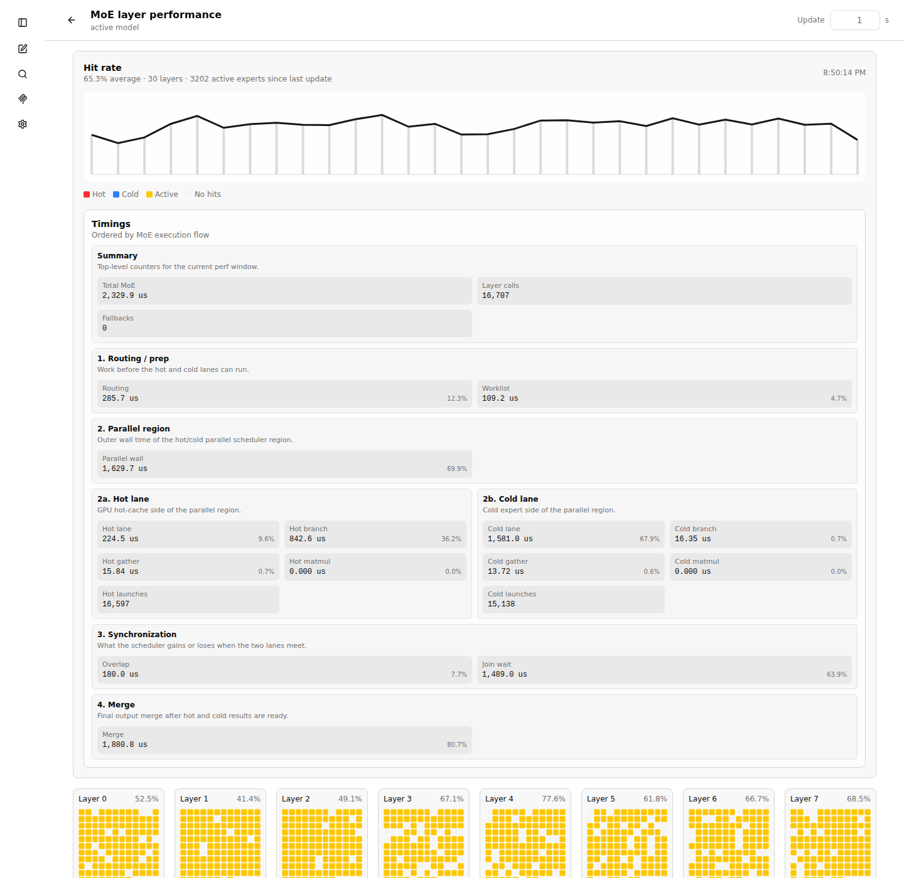
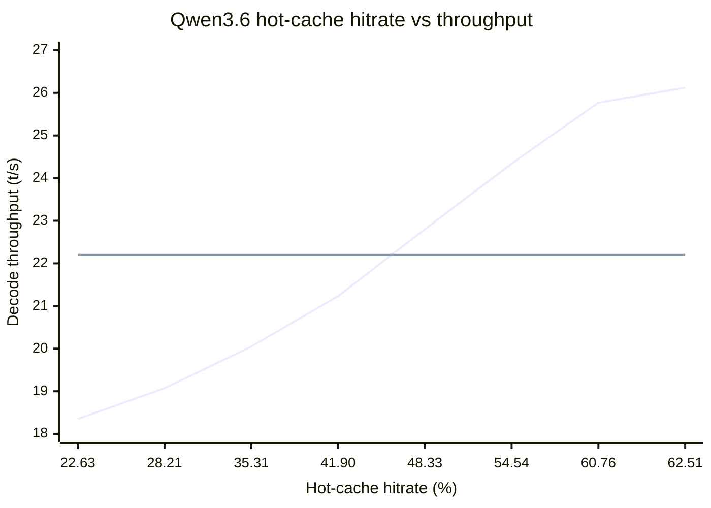

# Experimental MoE hot-cache fork

This is an experimental, AI-assisted fork of llama.cpp. The goal is to explore a static MoE expert hot cache for machines that can run large MoE models only with a CPU/GPU split.

Use with caution. The feature is experimental and workload-dependent. Qwen3.5/Qwen3.6 MoE is the primary optimized path; Gemma 4 26B-A4B has an experimental hot-cache graph hook.

Online documentation: <https://adrianhoehne.github.io/llama.cpp/>

## The idea

Large MoE models often do not fit fully into VRAM. In that case, part of the model stays on the CPU and token generation can become CPU-bound.

MoE models only use a subset of all experts for each token. If we know which experts are commonly used for a specific workload, we can keep those "hot" experts in a GPU cache and let the remaining "cold" expert work run on the CPU. The hot and cold paths can then run in parallel.

The difficult part is knowing which experts are hot. This fork adds a `/moe-layer-perf` endpoint that can collect layer and expert usage data. That JSON can then be used on the next run to prefill the expert cache. The cache can also update a configurable fraction of its entries after completed server runs.

Detailed developer documentation:

- [Usage guide and arguments](https://adrianhoehne.github.io/llama.cpp/docs/moe-hot-cache/moe-hot-cache-usage-guide.html)
- [Architecture explainer](https://adrianhoehne.github.io/llama.cpp/docs/moe-hot-cache/moe-hot-cache-architecture-explainer.html)
- [Journey and learnings](https://adrianhoehne.github.io/llama.cpp/docs/moe-hot-cache/moe-hot-cache-journey-learnings.html)
- [Interactive token visualization](https://adrianhoehne.github.io/llama.cpp/docs/moe-hot-cache/moe-experts-first-visual-explainer.html)
- [Qwen3Next implementation](https://adrianhoehne.github.io/llama.cpp/docs/moe-hot-cache/qwen3-coder-next-hot-cache-implementation.html)

## TL:DR QuickStart

Builds llama.cpp completely, including `llama-server`, `llama-cli`, and the embedded Web UI.

```bash
cmake --build build -j8
```

> [!WARNING]
> The first profiling run can take a long time because no hot cache is active yet and all MoE experts stay in RAM.

MoE hot-cache mode requires `--cpu-moe`. The regular expert weights must stay on the CPU/RAM path so the hot cache can add only the selected hot experts in VRAM and merge them with the cold CPU path.

First profiling run: collects expert statistics from representative prompts and writes them to `moe-hot-cache.json`.

```bash
./build/bin/llama-server --cpu-moe --moe-layer-perf-out moe-hot-cache.json <your normal start arguments>
```

Normal hot-cache start: loads the expert list, keeps the cold experts on the CPU via `--cpu-moe`, automatically fills free VRAM, and dynamically exchanges 10% of cache entries after requests. `--moe-hot-cache-auto-reserve-mib 1024` reserves 1024 MiB of VRAM for KV/compute/warmup buffers so warmup does not hit OOM.

```bash
./build/bin/llama-server --cpu-moe --moe-hot-cache moe-hot-cache.json --moe-hot-cache-max-mib -1 --moe-hot-cache-auto-reserve-mib 1024 --moe-hot-cache-update-rate 0.10 <your normal start arguments>
```

For hot-cache benchmarking and normal single-user tuning, prefer `--parallel 1`. Server-side parallel requests are not recommended for this feature because different prompts are likely to need different experts. Mixing them lowers the effective hot-cache hit rate and makes dynamic updates chase multiple workloads at once. This is separate from the internal hot/cold branch parallelization, which can stay enabled.

For large prompt-processing batches, add `--moe-hot-cache-pp-reduce-merge auto`. This reduces hot and cold MoE branch outputs before the final merge, which avoids carrying the full expert-slot tensor through the PP merge. Decode is unchanged.

Final speed test without perf counters, for the least distorted tokens/s measurement.

```bash
./build/bin/llama-server --no-perf --cpu-moe --moe-hot-cache moe-hot-cache.json --moe-hot-cache-max-mib -1 --moe-hot-cache-auto-reserve-mib 1024 <your normal start arguments>
```

## Workflow

### 1. Build

```bash
cmake --build build -j8
```

This builds the default llama.cpp targets, including `llama-server`, `llama-cli`, tools, examples, and tests.

### 2. Collect a representative profile

Start the server with `--cpu-moe` and without `--moe-hot-cache-max-mib`. This is the special first-run profiling mode: `--moe-layer-perf-out` enables expert counts and writes the collected `/moe-layer-perf` JSON to the given file. This file contains the raw per-layer `experts` lists used to build the initial cache.

`--moe-layer-perf-out` is only needed to create the initial profile. Do not use it for normal speed measurements.

```bash
./build/bin/llama-server \
  --cpu-moe \
  --moe-layer-perf-out moe-hot-cache.json \
  <your normal model, device, context and server arguments>
```

Run prompts that match your real workload. For example, if you use the model for coding, run several coding requests with similar context size, prompt style, and generation length.

The file is updated after completed requests and once more during server shutdown. You can still inspect the same data through the endpoint:

```bash
curl http://127.0.0.1:8080/moe-layer-perf
```

The Web UI also has a live MoE layer performance page at `#/moe-layer-perf`. Open it with the activity button next to the chat input actions. The dropdown next to that button controls the runtime MoE perf mode:

- `Full`: all counters and timing fields for detailed tuning.
- `Update`: only the counters required for dynamic hot-cache updates and hit-rate visualization.
- `Off`: MoE perf counters are disabled.

When the server starts with `--no-perf`, the dropdown starts in `Off`. The same mode switch is available through `POST /moe-layer-perf` with `{"mode":"full"}`, `{"mode":"update"}`, or `{"mode":"off"}`. The page shows the per-layer hit-rate graph, timing groups ordered by the MoE execution flow, and hot/cold expert heatmaps.



### 3. Start with the hot cache

Restart the server with `--cpu-moe`, the collected JSON, and a memory budget. Use a positive value for a fixed budget, or use `-1` to auto-size the hot cache from remaining VRAM after the model and KV cache are allocated.

`--cpu-moe` is required for the intended hot-cache graph path. It keeps the normal MoE expert tensors on the CPU/RAM path, while `--moe-hot-cache` adds a selected GPU-resident copy for hot experts.

Hot/cold parallelization runs in auto mode by default. Set `LLAMA_MOE_HOT_CACHE_PARALLEL=0` to disable it, or `LLAMA_MOE_HOT_CACHE_PARALLEL=force` for scheduler debugging.

```bash
./build/bin/llama-server \
  --cpu-moe \
  --moe-hot-cache moe-hot-cache.json \
  --moe-hot-cache-max-mib -1 \
  --moe-hot-cache-auto-reserve-mib 1024 \
  --moe-hot-cache-update-rate 0.10 \
  --moe-hot-cache-qwen-layer-curve 0.5 \
  <your normal model, device, context and server arguments>
```

`--moe-hot-cache-auto-reserve-mib` is only used with `--moe-hot-cache-max-mib -1`. It keeps that many MiB free for compute buffers, warmup, and CUDA transient allocations. Increase it if startup or warmup hits CUDA OOM; decrease it if the run is stable and VRAM is still unused.

`--moe-hot-cache-update-rate` controls dynamic replacement after completed server runs. `0.0` disables it; `0.10` replaces up to 10 percent of current hot-cache entries.

`--moe-hot-cache-qwen-layer-curve` is Qwen3.5/Qwen3.6 MoE specific. It controls how strongly layer wait/pressure timings influence the ranking. `0.0` disables this layer pressure, `0.5` is the damped default, and `1.0` aggressively favors layers that show more join/wait time in the performance JSON. The same curve is used for the initial cache selection and for dynamic update candidate ranking.

`--moe-hot-cache-weighting` selects the expert ranking mode. The default is `flat`. `flat` reproduces the even-distribution experiment: experts are ranked by hits inside each layer, then equal ranks are interleaved across layers, so a fixed budget is spread as evenly as possible over the observed layers. `flat` ignores the layer curve. Use `pressure` to restore the previous pressure-weighted default.

Gemma 4 26B-A4B has a separate experimental weighting class. It uses the same idea of layer-pressure scoring, defaults to a curve strength of `0.5`, and can be overridden with `LLAMA_MOE_HOT_CACHE_GEMMA4_LAYER_CURVE=<0.0..1.0>`. Gemma4 currently uses direct decode merge with a compact cold prefix as the primary path. Branch-Reduce-Merge remains available as a Gemma4-specific comparison path when direct decode merge is disabled. Qwen does not use Branch-Reduce-Merge.

`--moe-hot-cache-pp-reduce-merge auto` is an experimental prompt-processing optimization for hot-cache runs. During PP, each physical `ubatch` can contain hundreds of tokens; without this option the graph merges hot and cold outputs while they are still shaped as expert slots. With `auto`, large PP batches reduce each branch first to `[n_embd, n_tokens]` and merge the smaller tensors afterward. This is mathematically equivalent to summing all expert-slot outputs at the end, but it changes the floating-point addition order and can slightly affect sampled text. Leave it off when validating numerical drift; use `auto` when long prompts make PP relevant.

### 4. Measure performance

For detailed tuning, keep MoE perf mode at `Full` and inspect `/moe-layer-perf` or the Web UI. Look especially at hot slot ratio, routing/worklist time, parallel wall time, hot/cold lane wall time, overlap, join wait, merge time, and scheduler fallbacks.

`Full` mode also includes temporary `parallel_split_debug` fields for checking how the scheduler split the hot, cold, bridge, and join sections. These fields are only diagnostic and are not needed for dynamic cache updates.

For longer runs with dynamic cache replacement, use `Update` to keep only the counters needed by `--moe-hot-cache-update-rate`. This avoids the full per-node timing callback while still allowing the cache to adapt after completed requests.

The timing cards are ordered by execution flow:

1. Summary
2. Routing / prep
3. Parallel region
4. Hot lane and cold lane
5. Synchronization
6. Merge

Do not add all timing cards together. Some values are nested or overlapping measurements. `Parallel wall` is the wall time of the hot/cold region, `Hot lane` and `Cold lane` are lane wall times, `Overlap` is the time hidden by parallel execution, and `Join wait` is the time one lane waits for the other.

For final throughput measurements, disable the performance counters. With `--no-perf`, the MoE perf mode starts as `Off`; dynamic cache replacement needs `Update` or `Full`, so leave it off only when you want to measure raw throughput without adaptation.

```bash
./build/bin/llama-server \
  --no-perf \
  --cpu-moe \
  --moe-hot-cache moe-hot-cache.json \
  --moe-hot-cache-max-mib -1 \
  --moe-hot-cache-auto-reserve-mib 1024 \
  --moe-hot-cache-update-rate 0.10 \
  --moe-hot-cache-qwen-layer-curve 0.5 \
  <your normal model, device, context and server arguments>
```

Optional: enable periodic per-slot TG progress logging:

```bash
--log-tg-progress
```

### 5. Iterate

For small workload shifts, dynamic updates can adapt the cache entries within the existing per-layer slot layout. For larger workload changes, collect a new `/moe-layer-perf` JSON and restart with the new cache profile. A hot cache built from coding prompts can be worse for simple chat prompts, and the other way around.

## Next steps

- Tune auto-sizing and dynamic update defaults for different VRAM sizes.
- Support more MoE model families.
- Support multiple workload-specific cache profiles.

## Measured Qwen3.6 results

The following measurements used `unsloth/Qwen3.6-35B-A3B-GGUF:Q6_K_XL` with a `100000` token context and the coding prompt `Erstelle mir ein Snake Spiel in HTML und Java Script`.

The standard llama.cpp router setup averaged `22.2 t/s`. With MoE hot-cache enabled, auto-sizing selected `2367/10172` observed experts, using `6554 MiB` of VRAM, equivalent to about `9.2` full MoE layers.

Measured break-even was about `45.89%` real hot-cache hitrate.



| Real hot-cache hitrate | Decode throughput |
|---:|---:|
| 22.63% | 18.35 t/s |
| 28.21% | 19.07 t/s |
| 35.31% | 20.05 t/s |
| 41.90% | 21.23 t/s |
| 48.33% | 22.80 t/s |
| 54.54% | 24.34 t/s |
| 60.76% | 25.77 t/s |
| 62.51% | 26.12 t/s |

A separate experiment placed the four weakest MoE layers (`2,0,3,6`) and all router gates on `CUDA0`, then filled the remaining VRAM with hot experts. This did not improve throughput. The performance request timed out after 30 minutes at 1949 tokens with `41.33%` hitrate. The hot-cache shrank to `1389/10185` experts (`3877 MiB`, about `5.4` full MoE layers), and the overridden layers showed about `222 ms` MoE time per call. This hybrid approach needs a separate graph path that bypasses the hot/cold split for fully GPU-resident MoE layers.
