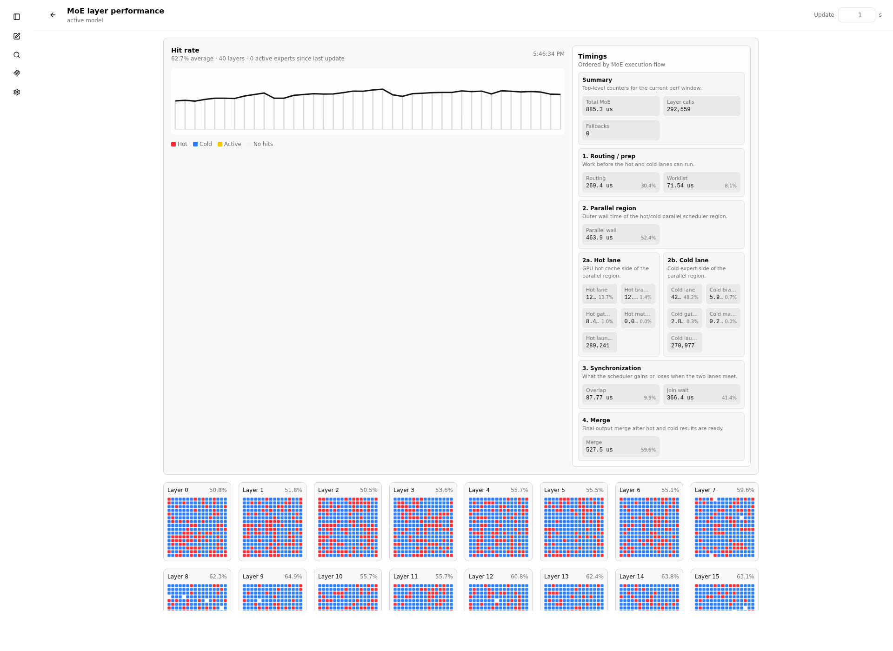

# MoE Hot-Cache: Entwicklerdokumentation

Stand: 2026-05-22
Branch: `cached-experts-v2`  
Aktueller Arbeitsstand: `flat` ist der Default fuer die Hot-Cache-Gewichtung; der Hot-Cache-Pfad setzt `--cpu-moe` voraus.

Diese Dokumentation beschreibt die experimentelle MoE-Hot-Cache-Parallelisierung in diesem Fork: was geaendert wurde, warum es geaendert wurde, wie der Code zur Laufzeit arbeitet, welche Schalter relevant sind und wie die bisherigen Performance-Ergebnisse einzuordnen sind.

Der Fokus liegt auf Qwen3.5/Qwen3.6 MoE, insbesondere auf dem Ziel, Decode/TG durch eine Aufteilung der Expertenarbeit auf GPU und CPU schneller zu machen. Zusaetzlich gibt es einen getrennten experimentellen Hot-Graph-Hook fuer Gemma 4 26B-A4B.

Wichtig zur Gemma4-Namensgebung: `gemma-4-E4B` ist nach den lokalen GGUF-Metadaten ein dichtes Gemma4-Modell mit 42 Transformer-Layern und kein MoE-Modell. Fuer den MoE-Hot-Cache ist die relevante Gemma-Variante `gemma-4-26B-A4B`, also 26B total mit ca. 4B aktiven Parametern.

## Kurzfassung

Die Aenderung fuehrt einen optionalen Hot-Cache fuer MoE-Experten ein.

Ohne Hot-Cache laeuft der Server wie vorher. Der Hot-Cache-Pfad ist fuer den Betrieb mit `--cpu-moe` gebaut: die normalen MoE-Expertentensoren bleiben im CPU/RAM-Pfad, waehrend nur die ausgewaehlten Hot-Experts zusaetzlich in den GPU-Cache kopiert werden. Erst wenn ein Hot-Cache-Budget gesetzt wird, wird der neue Pfad aktiv:

```text
--moe-hot-cache-max-mib != 0
```

Dann muss zusaetzlich eine Hot-Cache-JSON-Datei gesetzt sein:

```text
--moe-hot-cache <datei.json>
```

Der neue Pfad:

1. analysiert eine Perf-JSON mit Layer-/Expertennutzung,
2. waehlt pro Layer eine Menge "hot" Experten innerhalb eines Speicherbudgets,
3. kopiert diese hot Experten in einen eigenen Cache,
4. baut fuer aktive Layer einen spezialisierten MoE-Hot-Graph fuer das jeweilige Modell,
5. trennt zur Laufzeit hot und cold Expertenarbeit,
6. fuehrt hot Arbeit auf der GPU und cold Arbeit auf der CPU parallel aus,
7. merged die Ergebnisse danach wieder in den normalen Tensorfluss.

Die wichtigsten Ziele waren:

- GPU-Auslastung im Decode besser nutzen,
- cold Expertenarbeit nicht laenger komplett seriell hinter der GPU ausfuehren,
- Overhead im Decode reduzieren,
- Perf-Messung auf Optimierungsdaten statt Visualisierungsdaten fokussieren,
- den experimentellen Code moeglichst getrennt vom upstream-nahen Kern halten.

## Ergebnisstand

Die Zahlen sind keine formalen Benchmarks, sondern Entwicklungslaeufe aus diesem Branch. Sie sind trotzdem hilfreich, weil sie die Richtung der Optimierung zeigen.

| Zustand | Beobachtung |
| --- | --- |
| Ohne Hot/Cold-Parallelisierung, einfacher "Hallo"-Test | ca. 19.7 tk/s |
| Erster paralleler PoC mit unguenstiger Hot-Liste | ca. 13.96 tk/s bei einfachem Prompt |
| Fruehe Programmiertasks | ca. 16 bis 17 tk/s |
| Nach Scheduler-, Routing- und Merge-Optimierungen | ueber 20 tk/s |
| Spaetere Performance-Laeufe `performance40` bis `performance52` | ca. 23.7 bis 25.5 tk/s |
| `performance53` | knapp unter 26 tk/s |
| `performance54` | ca. 27.1 tk/s |
| `performance55` | ca. 27.76 tk/s |
| `performance56` | ca. 28.09 tk/s |
| `flat`-Kontrolllauf mit normalem `qwen36`-Profil, 1024 Tokens | ca. 24.13 tk/s bei 53.27 Prozent Hitrate; praktisch gleichauf mit `pressure` im selben Kurzlauf |
| Qwen3.6 Break-even-Reihe | Standard-llama lag im Router-Modus bei ca. 22.2 tk/s; Hot-Cache ueberholte ab ca. 45.9 Prozent realer Hitrate |
| Qwen3.6 mit MTP | kein Vorteil im lokalen Setup; ein MTP-Lauf lag trotz ca. 94 Prozent Draft-Acceptance bei ca. 25.33 tk/s und damit unter guten Non-MTP-Hot-Cache-Laeufen |
| Gemma4 26B-A4B nach Decode-/Merge-Anpassungen | stabiler als der erste Gemma4-Hot-Graph; direkte Decode-Merge-/Cold-Prefix-Pfade brachten sichtbaren Speedup ohne Qwen-Pfad zu beruehren |
| Quadro M1200 als zweite Warm-Lane | kein stabiler Gewinn; beste gemessene Variante war Hot auf CUDA0 plus Cold auf CPU, ohne Warm-Lane |

Der groesste qualitative Fortschritt war nicht ein einzelner Patch, sondern die Kombination aus:

- weniger Decode-Routing-Overhead,
- weniger Merge-Overhead,
- weniger unnoetigen Branch-Starts,
- besserem Cold-Pfad,
- Hot/Cold-Regionen im Scheduler,
- reduzierter Perf-Messlast,
- sauberem Gating, damit der normale Pfad unberuehrt bleibt.

Die aktuelle Standardauswahl fuer neue Hot-Cache-Laeufe ist `--moe-hot-cache-weighting flat`. Dieser Modus verteilt das Budget moeglichst gleichmaessig ueber die beobachteten Layer. Der vorherige druckgewichtete Modus bleibt mit `--moe-hot-cache-weighting pressure` verfuegbar.

## Aktuelle experimentelle Learnings

### `--cpu-moe` ist Teil des Hot-Cache-Modells

Der Hot-Cache beschleunigt nicht einen beliebigen GPU-Offload-Zustand, sondern den konkreten Split:

```text
hot experts  -> GPU-Hot-Cache
cold experts -> normaler CPU-MoE-Pfad
```

Deshalb gehoert `--cpu-moe` in den Learn-Run, den normalen Hot-Cache-Start und finale `--no-perf`-Messungen. Ohne `--cpu-moe` koennen Experten bereits durch llama.cpp-Offload-Regeln auf der GPU landen; dann fehlt der kontrollierte Cold-Pfad, den unser Hot/Cold-Graph erwartet.

### Mehr VRAM fuer ganze Layer war nicht automatisch besser

Mehrere Qwen-Experimente haben ganze schwache Layer oder fruehe Layer per `override-tensor` auf die GPU gelegt und danach den restlichen VRAM mit Hot-Experts gefuellt. Das sah naheliegend aus, war aber schlechter als der reine Hot-Cache-Ansatz:

- der Hot-Cache schrumpft, weil volle Layer sehr viel VRAM binden,
- die Hitrate der uebrigen Layer sinkt,
- voll GPU-residente Layer laufen trotzdem noch durch den Hot/Cold-Graph, solange kein eigener Bypass fuer diese Layer existiert,
- der Merge-/Scheduler-Overhead bleibt also teilweise erhalten.

Die Konsequenz: Ganze Layer per Override sind erst dann wieder interessant, wenn es einen separaten Graph-Pfad gibt, der voll GPU-residente MoE-Layer ohne Hot/Cold-Split verarbeitet.

### MTP war auf dem lokalen Setup kein Default-Gewinn

Qwen3.6-MTP erreichte zwar hohe Draft-Acceptance, erzeugte aber zusaetzlichen Context-/Graph-/Compute-Speicher. In den beobachteten Laeufen war Hot-Cache ohne MTP schneller. MTP kann bei mehr VRAM oder anderer llama.cpp-MTP-Implementierung wieder interessant werden, ist fuer diesen Branch aber kein empfohlener Default. Details stehen in `docs/development/moe-hot-cache-mtp-learnings.md`.

### Eine zweite langsame GPU ist kein kostenloser Cold-Ersatz

Der Versuch mit der Quadro M1200 als Warm-Lane zeigte, dass CUDA1 nicht einfach CPU-Arbeit ersetzt. Die Warm-Lane erzeugt zusaetzliche Synchronisation, Bridge-Arbeit und Transferdruck zurueck auf CUDA0, wo der finale Join/Merge stattfindet. Die beste gemessene Gemma4-Variante fuer diese Hardware war deshalb:

```text
CUDA0: Hot-Cache
CPU:   Cold-Branch
CUDA1: keine Warm-Lane
```

Die detaillierten Zahlen stehen in `docs/development/moe-hot-cache-warm-lane-analysis.md`.

### Groessere, RAM-lastige Modelle brauchen eher Cold-Pfad-Arbeit

Beim 122B-Qwen-Test wechselten die Expertenlisten staerker und das Modell lag wesentlich staerker im RAM. In diesem Szenario bringt eine noch feinere statische Expertenliste weniger als Overhead- und Cold-Pfad-Reduktion. Fuer sehr grosse MoE-Modelle ist die wichtigste Frage daher nicht nur "welche Experten sind hot?", sondern "wie billig bleibt der unvermeidbare CPU-Anteil?".

## Wichtige Begriffe

`hot experts`  
Experten, die laut Perf-Daten haeufig genug oder teuer genug sind, um in den GPU-Hot-Cache zu kommen.

`cold experts`  
Experten, die nicht in den Hot-Cache passen oder nicht ausgewaehlt wurden. Sie bleiben im normalen Modellpfad und werden im Parallelmodus bevorzugt auf der CPU verarbeitet.

`hot slot ratio`  
Anteil der MoE-Slots, die durch hot Experten bedient werden. Bei den bisherigen Daten lag die praktische Erwartung bei etwa 68 bis 70 Prozent. Deshalb muss der Overhead niedrig sein: die GPU kann nicht 100 Prozent der Expertenarbeit treffen.

`slot`  
Ein konkreter Token-Expert-Auftrag. Bei `n_expert_used = 8` entstehen pro Token bis zu acht Experten-Slots. Wird `n_expert_used` auf 16 erhoeht, verdoppelt sich diese Slot-Arbeit grob, sofern das Modell und die Architektur das zulassen.

`decode`  
Der Ein-Token-Pfad waehrend der Token-Generierung. Genau hier ist Overhead besonders kritisch.

`prefill`  
Der Prompt-Verarbeitungspfad mit vielen Tokens. Er hat andere Kostenverhaeltnisse als Decode.

## Aktivierung und Gating

Der Hot-Cache ist explizit gated. Das ist wichtig, weil der Fork weiterhin ohne Experiment wie normales llama.cpp laufen soll.

Der neue Pfad ist deaktiviert, wenn:

```text
moe_hot_cache_max_mib == 0
```

Dann passiert beim Laden:

- `llama_moe_hot_cache_init(...)` kehrt ohne Cache-Aufbau zurueck,
- `model.moe_hot_cache` bleibt leer,
- angebundene Modelle verwenden ihren normalen MoE-/FFN-Pfad,
- der Hot-Cache-Graph wird nicht gebaut,
- der Scheduler sieht keine Hot-Cache-Parallelregion.

Der neue Pfad ist aktiv, wenn:

```text
--cpu-moe
--moe-hot-cache-max-mib <N>
--moe-hot-cache <datei.json>
```

`N > 0` baut einen Cache mit festem MiB-Budget. `N = -1` aktiviert Auto-Sizing: der Cache wird erst nach der echten KV-Cache-Allokation im `llama_context` aufgebaut und nutzt den dann noch freien VRAM abzüglich `--moe-hot-cache-auto-reserve-mib`.

Wenn ein Budget gesetzt ist, aber keine JSON-Datei, ist das absichtlich ein Fehler. Sonst waere unklar, welche Experten gecached werden sollen. `--cpu-moe` ist keine harte Parser-Abhaengigkeit, aber eine funktionale Voraussetzung fuer den erwarteten Hot/Cold-Pfad.

Der modell-spezifische Hot-Pfad wird pro Layer nur gebaut, wenn:

```text
llama_moe_hot_cache_layer_active(model, il)
```

`true` liefert.

Damit koennen einzelne Layer aktiv sein, andere aber normal laufen.

## CLI- und Env-Schalter

### MoE-Platzierung

```text
--cpu-moe
LLAMA_ARG_CPU_MOE=true
```

Haelt alle MoE-Expertengewichte im CPU/RAM-Pfad. Fuer den Hot-Cache ist das der empfohlene und praktisch erforderliche Startzustand: cold Experten bleiben auf der CPU, hot Experten werden zusaetzlich in den GPU-Hot-Cache kopiert.

`--n-cpu-moe` ist nicht dasselbe. Es verschiebt nur die ersten N MoE-Layer auf die CPU und erzeugt damit keinen sauberen vollstaendigen Cold-Pfad fuer den Hot-Cache.

### Hot-Cache-Auswahl

```text
--moe-hot-cache <datei.json>
LLAMA_ARG_MOE_HOT_CACHE=<datei.json>
```

Pfad zur Perf-/Hot-Cache-JSON.

```text
--moe-hot-cache-max-mib <N>
LLAMA_ARG_MOE_HOT_CACHE_MAX_MIB=<N>
```

Maximales Speicherbudget fuer den Hot-Cache in MiB. `0` deaktiviert die Funktion, positive Werte sind feste Budgets, `-1` aktiviert Auto-Sizing. Auto-Sizing erfordert eine explizite `--ctx-size`, weil der KV-Cache Teil der Speicherentscheidung ist.

```text
--moe-hot-cache-auto-reserve-mib <N>
LLAMA_ARG_MOE_HOT_CACHE_AUTO_RESERVE_MIB=<N>
```

Nur relevant bei `--moe-hot-cache-max-mib -1`. Der Wert gibt an, wie viele MiB nach KV-Cache und vor dem Hot-Cache frei bleiben sollen. Default ist `1024`. Hoehere Werte sind konservativer und vermeiden CUDA-OOM beim Warmup oder bei Compute-Transienten; niedrigere Werte machen den Hot-Cache groesser.

```text
--moe-hot-cache-qwen-layer-curve <N>
LLAMA_ARG_MOE_HOT_CACHE_LAYER_CURVE=<N>
LLAMA_MOE_HOT_CACHE_LAYER_CURVE=<N>
```

Primaer fuer Qwen35Moe. Steuert die Layer-Druck-Gewichtung bei der Hot-Cache-Auswahl. `0.0` nutzt die normale Expert-Rangfolge ohne Layer-Wartezeit. `0.5` ist der gedaempfte Default. `1.0` gewichtet wartende Layer aggressiv. Intern lesen die Gewichtungen zuerst `LLAMA_MOE_HOT_CACHE_LAYER_CURVE`; alte spezifische Aliase wie `LLAMA_MOE_HOT_CACHE_QWEN_LAYER_CURVE` werden noch als Fallback akzeptiert.

```text
--moe-hot-cache-weighting <MODE>
LLAMA_ARG_MOE_HOT_CACHE_WEIGHTING=<MODE>
```

Steuert den Ranking-Modus fuer die Hot-Cache-Auswahl und das dynamische Update. Die wichtigsten Modi sind `flat`, `pressure`, `smooth`, `time` und `balanced`; zusaetzlich existieren Entwicklungsvarianten wie `smooth-pressure`, `capped`, `capped-pressure`, `soft-pressure`, `moe-time`, `decode-time`, `rank` und `layer-rank`. Default ist `flat`. `flat` verteilt das Budget moeglichst gleichmaessig ueber die beobachteten Layer: erst werden Experten innerhalb jedes Layers nach Hits sortiert, danach werden gleiche Raenge ueber alle Layer interleaved. Die Layer-Curve hat auf `flat` keinen Einfluss. `pressure` stellt den vorherigen druckgewichteten Default wieder her.

```text
LLAMA_MOE_HOT_CACHE_GEMMA4_LAYER_CURVE=<N>
```

Nur fuer Gemma4. Steuert die gleiche Layer-Druck-Gewichtung fuer initiale Hot-Cache-Auswahl und dynamisches Update. `0.0` nutzt die normale Expert-Rangfolge ohne Layer-Druck, `0.5` ist der Default, `1.0` gewichtet wartende Layer aggressiv. Dieser Schalter ist aktuell nur als Env-Variable vorhanden.

### Parallelisierung

```text
LLAMA_MOE_HOT_CACHE_PARALLEL=1
```

Aktiviert Hot/Cold-Parallelisierung im Auto-Modus. Das ist auch der Default, wenn `LLAMA_MOE_HOT_CACHE_PARALLEL` nicht gesetzt ist.

```text
LLAMA_MOE_HOT_CACHE_PARALLEL=force
```

Aktiviert den Force-Modus. Wenn die Region nicht korrekt parallelisiert werden kann, wird nicht still auf seriell zurueckgefallen, sondern ein Fehler erzeugt. Dieser Modus war hilfreich beim Debugging, ist aber fuer normale Tests riskanter.

```text
LLAMA_MOE_HOT_CACHE_PARALLEL=0
```

Deaktiviert die Parallelisierung.

```text
LLAMA_MOE_HOT_CACHE_PARALLEL_MIN_SLOTS=<N>
```

Mindestanzahl Slots, ab der der Scheduler die Hot/Cold-Parallelregion startet. Default: `2`.

Ziel: Fuer sehr kleine Arbeitspakete ist Thread-/Scheduler-Overhead teurer als parallele Ausfuehrung.

```text
LLAMA_MOE_HOT_CACHE_BRANCH_REDUCE_MERGE=0
```

Deaktiviert den Gemma4-Branch-Reduce-Merge-Vergleichspfad. Der primaere Gemma4-Decode-Pfad ist inzwischen direkter Decode-Merge mit kompaktem Cold-Prefix. Branch-Reduce-Merge bleibt nuetzlich fuer Gegenlaeufe oder wenn `LLAMA_MOE_HOT_CACHE_DECODE_DIRECT_MERGE=0` gesetzt wird. Qwen35Moe setzt diesen Profil-Schalter explizit nicht.

### Decode- und Merge-Optimierungen

Die folgenden Schalter sind als Entwicklungshebel vorhanden. Viele davon sind aktuell default-aktiv, weil sie in den spaeteren Laeufen Performance gebracht haben.

```text
LLAMA_MOE_HOT_CACHE_CPU_DECODE_ROUTING=1
```

Routing im Decode ueber einen CPU-Custom-Op-Pfad.

```text
LLAMA_MOE_HOT_CACHE_DECODE_DIRECT_MERGE=1
```

Direkter Merge-Pfad fuer Decode.

```text
LLAMA_MOE_HOT_CACHE_DECODE_STRIDED_SUM_ROWS=1
```

Optimierter Summenpfad fuer Decode-Merge.

```text
LLAMA_MOE_HOT_CACHE_HOT_DUMMY_PADDING=1
```

Padding fuer Hot-Arbeit, damit Graph-/Backend-Erwartungen stabil bleiben.

```text
LLAMA_MOE_HOT_CACHE_SHARED_INPUT_ROW=1
```

Optimierung fuer geteilte Input-Zeilen im Hot-Pfad.

```text
LLAMA_MOE_HOT_CACHE_COLD_PREFIX_SUM=1
LLAMA_MOE_HOT_CACHE_COLD_PREFIX_WEIGHTED_SUM=1
```

Optimierungen fuer den Cold-Pfad.

```text
LLAMA_MOE_HOT_CACHE_DECODE_REPEAT_HOT_INPUT=1
LLAMA_MOE_HOT_CACHE_COLD_FIRST_ROW_INPUT=1
```

Weitere Decode-spezifische Reduktionen von Gather-/Input-Overhead.

### Perf

```text
--no-perf
```

Deaktiviert die llama.cpp-Perf-Zaehler und startet den MoE-Perf-Modus mit `off`. Der Modus kann zur Laufzeit wieder auf `update` oder `full` gestellt werden.

```text
--moe-layer-perf-out <datei.json>
LLAMA_ARG_MOE_LAYER_PERF_OUT=<datei.json>
```

Server-only Hilfsschalter fuer den ersten Profiling-Lauf. Er aktiviert detaillierte Expert-Counts und schreibt die aktuelle `/moe-layer-perf`-JSON nach abgeschlossenen Requests sowie einmal beim Shutdown in die angegebene Datei. Ohne aktiven Hot-Cache erzeugt er rohe per-Layer `experts`-Listen. Mit aktivem Hot-Cache koennen zusaetzlich `hot_experts` und `cold_experts` entstehen.

```text
LLAMA_MOE_LAYER_PERF=full|update|off
```

Setzt den initialen MoE-Perf-Modus, falls der Server ihn nicht explizit aus `--no-perf` ableitet. `full` sammelt alle bisherigen Zaehler und Timing-Felder. `update` sammelt nur die Daten, die das dynamische Hot-Cache-Update braucht: Expert-Counts, Hot/Cold-Slots und Hot/Cold/Join-Wartezeiten. `off` deaktiviert den MoE-Perf-Pfad.

Zur Laufzeit kann der Modus per HTTP geaendert werden:

```bash
curl -X POST http://127.0.0.1:8080/moe-layer-perf \
  -H 'Content-Type: application/json' \
  -d '{"mode":"update"}'
```

Im Routermodus kann `?model=<name>&autoload=false` mitgegeben werden.

## Dateiuebersicht

### `src/llama-moe-hot-cache.h`

Zentrale Datentypen fuer den Hot-Cache:

- Cache-Konfiguration,
- Layer-Konfiguration,
- Expert-Auswahl,
- Tensor- und Worklist-Layouts,
- Hilfsfunktionen zur Abfrage, ob ein Layer aktiv ist.

Wichtige Worklist-Felder:

```text
HOT_ID
HOT_SRC_SLOT
HOT_TOKEN_ID
HOT_WEIGHT
COLD_ID
COLD_SRC_SLOT
COLD_TOKEN_ID
COLD_WEIGHT
HOT_EXPERT_ID
HOT_COUNT
COLD_COUNT
```

Die Worklist trennt hot und cold Slots. Der Scheduler und die Merge-Logik koennen dadurch beide Pfade getrennt behandeln.

### `src/llama-moe-hot-cache.cpp`

Zustaendig fuer:

- Parsen der JSON-Datei,
- Erkennen unterstuetzter Schemas,
- Sammeln der Expertengroessen,
- neutrales Scoring fuer nicht spezialisierte Modelle,
- Auswahl innerhalb des Speicherbudgets,
- Allokation der Hot-Cache-Tensoren,
- Kopieren der ausgewaehlten Experten,
- Aufbau von Mapping- und Maskentabellen.

Unterstuetzte Schemas:

```text
llama.cpp.moe_layer_perf.v1
llama.cpp.moe_layer_opt_perf.v1
```

Die generische Auswahl bleibt absichtlich schlicht. Sie nutzt die beobachteten Expert-Counts ohne modell-spezifische Layer-Heuristik. Qwen35Moe und Gemma4 haben eigene Gewichtungsklassen, die aus derselben Beobachtungsliste architekturspezifische Scores berechnen.

### `src/models/qwen35moe-hot-cache.cpp`

Enthaelt die Qwen35Moe-spezifische Gewichtung fuer die Hot-Cache-Auswahl.

Die Klasse `llama_moe_hot_cache_qwen35moe_weighting` bewertet die neutral geparsten Layer-/Expert-Beobachtungen neu. Fuer Qwen35Moe zaehlt dabei nicht nur, wie oft ein Experte vorkommt, sondern auch wie stark der Layer die parallele Region aufhaelt. Die Gewichtung nutzt bevorzugt die absolute Join-Wartezeit pro Layer und faellt sonst auf Cold-/Hot-Lane-Differenz, Cold-Slots oder Wait-per-Cold-Slot zurueck.

Die Staerke der Kurve ist ueber `--moe-hot-cache-qwen-layer-curve` steuerbar. Der Default `0.5` ist bewusst gedaempft: wartende Layer werden bevorzugt, andere Layer sollen aber nicht zu stark aus dem Cache gedrueckt werden.

Dieselbe Gewichtung wird auch beim dynamischen Update verwendet. Dort kann sie aber nur Austausch-Kandidaten zwischen Layern priorisieren. Die Anzahl der Hot-Cache-Slots pro Layer bleibt unveraendert, weil eine echte Umverteilung Tensor-Neuallokation oder einen zweiten Cache benoetigen wuerde.

Bereits hot gecachte Experten bekommen einen kleinen Sticky-Bonus. Dadurch bleibt das Cache-Set stabiler und wechselt nicht bei jedem kleinen Ausreisser.

### `src/models/gemma4-hot-cache.cpp`

Enthaelt die Gemma4-spezifische Gewichtung fuer die Hot-Cache-Auswahl.

Die Klasse `llama_moe_hot_cache_gemma4_weighting` bewertet dieselben Layer-/Expert-Beobachtungen wie die Qwen-Gewichtung, bleibt aber getrennt vom Qwen-Code. Die Gewichtung nutzt bevorzugt die absolute Join-Wartezeit pro Layer und faellt dann auf Cold-/Hot-Lane-Differenz, Cold-Slots oder Wait-per-Cold-Slot zurueck.

Die Staerke wird ueber `LLAMA_MOE_HOT_CACHE_GEMMA4_LAYER_CURVE` gesteuert. Default ist `0.5`. Die Gewichtung wird sowohl beim initialen Einlesen der JSON als auch beim dynamischen Update verwendet. Bereits hot gecachte Experten erhalten ebenfalls einen kleinen Sticky-Bonus.

### `src/llama-moe-hot-cache-graph.cpp`

Enthaelt die ausgelagerte Hot-Cache-Graph-Logik fuer die angebundenen Modelle.

Das war ein wichtiger Refactor-Schritt: Der experimentelle Graph-Code wurde aus den Modellfiles herausgezogen, damit `src/models/qwen35moe.cpp` und `src/models/gemma4.cpp` upstream-naeher bleiben.

Aufgaben:

- Hot/Cold-FFN fuer Qwen35Moe bauen,
- Hot/Cold-MoE fuer Gemma4 aus Logits bauen,
- Decode-spezifische Worklist erstellen,
- CPU-Custom-Ops fuer Routing und Merge einbinden,
- Hot-Branch mit gecachten Experten bauen,
- Cold-Branch mit normalen Experten bauen,
- Branch-Ausgaben zusammenfuehren,
- Scheduler-Parallelregion annotieren,
- lokale `mul_mat_id`-Flags setzen.

Wichtig: Der Code ist kein allgemeiner MoE-Ersatz fuer alle Architekturen. Neue Modelle sollen ueber kleine Modell-Hooks, architekturspezifische Profile und eigene Gewichtungsklassen angebunden werden, damit Qwen-Pfade keine Seiteneffekte bekommen.

### `src/models/qwen35moe.cpp`

Dieses File ist nach dem Refactor wieder deutlich kleiner.

Die zentrale Entscheidung ist:

```text
Wenn der Layer einen aktiven Hot-Cache hat:
    build_layer_ffn_hot(...)
Sonst:
    normaler build_moe_ffn(...)
```

Damit bleibt der normale Modellpfad erhalten.

### `src/models/gemma4.cpp`

Enthaelt nur den kleinen Gemma4-Hook in den ausgelagerten Hot-Graph:

```text
Wenn der Layer einen aktiven Hot-Cache hat:
    build_layer_moe_hot(...)
Sonst:
    normaler build_moe_ffn(...)
```

Die eigentliche Gemma4-Hot-Cache-Logik bleibt in `src/llama-moe-hot-cache-graph.cpp` und `src/models/gemma4-hot-cache.cpp`. Dadurch bleibt der Gemma4-Modellpfad getrennt vom Qwen-Pfad.

### `src/llama-moe-hot-cache-perf.h`

Deklariert die MoE-Perf-Schnittstellen.

Wichtig ist vor allem:

```text
llama_moe_layer_perf_json(ctx)
```

Diese Funktion ist auch ueber die oeffentliche API in `include/llama.h` erreichbar.

### `src/llama-moe-hot-cache-perf.cpp`

Enthaelt die MoE-spezifische Perf-Sammlung und JSON-Ausgabe.

Vor dem Refactor lag relevante Logik in `llama-context.cpp`. Sie wurde ausgelagert, damit der Kernkontext upstream-naeher bleibt.

Erfasste Daten:

- globale Summary,
- Layer-Calls,
- Hot-Slot-Ratio,
- Routing-Zeit,
- Worklist-Zeit,
- Merge-Zeit,
- Hot-Branch-Zeit,
- Cold-Branch-Zeit,
- Hot-/Cold-Matmul-Zeit,
- Gather-/Scatter-Zeiten,
- Parallelregion-Zeiten,
- Join-Wartezeit,
- Overlap,
- Launch-/Fallback-Counts,
- Expert-Counts in den Modi `full` und `update`,
- temporaere Scheduler-Split-Debugdaten im Modus `full`.

`parallel_split_debug` zeigt die zuletzt beobachteten Hot-, Cold- und Join-Splits inklusive Backend-IDs. Das Feld ist nur Diagnose fuer Scheduler-Arbeit und wird fuer dynamische Updates nicht benoetigt.

Wenn Perf deaktiviert ist, liefert die JSON-Funktion absichtlich nur einen kleinen Disabled-Block:

```json
{
  "enabled": false,
  "mode": "off",
  "schema": "llama.cpp.moe_layer_opt_perf.v1",
  "layers": []
}
```

### `src/llama-context.cpp`

Enthaelt kleine Hooks fuer:

- Auto-Hot-Cache-Aufbau bei `--moe-hot-cache-max-mib -1` nach der echten KV-Cache-Allokation,
- Perf-Callback setzen,
- Scheduler-Perf aktivieren,
- Graph-Compute wie vorher ausfuehren.

Wenn der MoE-Perf-Modus `off` ist, wird der MoE-Perf-Pfad nicht gesetzt. `--no-perf` setzt diesen Modus beim Serverstart initial auf `off`.

### `src/llama.cpp`

Initialisiert den Hot-Cache beim Modell-Laden fuer feste Budgets:

```text
llama_moe_hot_cache_init(*model, params)
```

Die Funktion ist durch `moe_hot_cache_max_mib` gated. Positive Budgets werden beim Modell-Laden aufgebaut. `-1` wird bewusst bis zur Context-Erstellung verschoben, damit der echte freie VRAM nach KV-Cache-Allokation verwendet wird.

### `src/llama-model.cpp` und verwandte Param-Dateien

Erweitern die Modellparameter um:

```text
moe_hot_cache_path
moe_hot_cache_max_mib
moe_hot_cache_auto_reserve_mib
```

Das Modell besitzt ausserdem den Hot-Cache-Zustand:

```text
std::unique_ptr<llama_moe_hot_cache> moe_hot_cache
```

### `src/llama-graph.cpp` und `src/llama-graph.h`

Diese Dateien wurden wieder upstream-naeher gemacht.

Fruehere Hot-Cache-spezifische Erweiterungen wie:

- spezieller `build_moe_ffn_with_ids`,
- `llm_mul_mat_id_flags`,
- Hot-Cache-spezialisiertes `build_lora_mm_id`-Verhalten,

wurden aus dem allgemeinen Graph-Code herausgezogen.

Das reduziert Konflikte bei upstream-Updates.

### `ggml/include/ggml-backend-moe-hot-cache.h`

Neuer experimenteller Header fuer die Scheduler-API des Hot-Cache.

Der Grund fuer den separaten Header: `ggml-backend.h` soll moeglichst wenig experimentelle API enthalten.

### `ggml/src/ggml-backend-moe-hot-cache.inc`

Private Implementierung der Scheduler-Erweiterung.

Dieses `.inc` wird aus `ggml-backend.cpp` eingebunden. Dadurch kann der Code weiterhin auf interne Scheduler-Strukturen zugreifen, ohne die komplette Implementierung direkt in `ggml-backend.cpp` stehen zu lassen.

Aufgaben:

- Parallelregionen registrieren,
- Split-Boundaries erzwingen,
- Region validieren,
- Hot- und Cold-Splits identifizieren,
- optional einen Bridge-Split zwischen Lane-Ende und Join erlauben,
- CPU-Worker fuer Cold-Pfad starten,
- Hot-Pfad auf dem normalen Thread/GPU-Backend laufen lassen,
- beide Pfade joinen,
- Fehler/Fallbacks erfassen,
- Scheduler-Perf-Daten sammeln.

Der Bridge-Split wird ueber das Flag `GGML_BACKEND_SCHED_MOE_HOT_CACHE_PARALLEL_FLAG_ALLOW_JOIN_BRIDGE` erlaubt. Das ist fuer Gemma4 wichtig, weil Cold-Prefix-Merge oder Branch-Reduce-Merge nach den Hot/Cold-Lanes noch einen kleinen seriellen Split vor dem Join erzeugen koennen. Ohne Flag bleibt die Validierung strikt bei Hot-then-Cold-then-Join.

### `ggml/src/ggml-backend.cpp`

Nur noch kleine Integrationspunkte:

- Scheduler-State besitzt einen Hot-Cache-Zustandspointer,
- Init/Free/Reset hooken den Zustand,
- Split-Boundaries fragen die Hot-Cache-Logik,
- das `.inc` wird eingebunden.

Das ist absichtlich so gehalten, damit upstream-Konflikte kleiner bleiben.

### `ggml/src/ggml-cpu/ggml-cpu.c`

CPU-Backend-Anpassungen fuer die Hot-Cache-MoE-Arbeit.

Relevante Punkte:

- `MUL_MAT_ID` kann ueber `op_params` fuer Hot-Cache-Layouts gesteuert werden,
- negative IDs koennen erlaubt werden,
- Zeroing kann uebersprungen werden, wenn ein Pfad garantiert keine Ausgabe schreiben muss,
- bestimmte Decode-Layouts mit geteilten Input-Zeilen werden unterstuetzt.

Diese Anpassung ist eine der Stellen, die nicht komplett ausserhalb des Kerns liegen kann.

### `ggml/src/ggml-cuda/ggml-cuda.cu`

CUDA-Backend-Anpassungen fuer `MUL_MAT_ID`-Varianten, die im Hot-Pfad gebraucht werden.

Relevante Punkte:

- Hot-Cache-Flags aus `op_params`,
- Unterstuetzung spezieller ID-Layouts,
- Vermeidung unnoetiger Arbeit bei bekannten Decode-Faellen.

Auch diese Anpassung ist ein Kernhook und deshalb eine moegliche Konfliktstelle bei upstream-Updates.

### `tests/test-moe-hot-cache.cpp`

Unit Tests fuer:

- JSON-Auswahl,
- Budget-/Layer-Verhalten,
- Worklist-/Mapping-Grundlagen,
- Gating-Faelle,
- Qwen- und Gemma4-Gewichtung.

Bei weiteren Refactors sollte dieses Testfile erweitert werden, bevor Optimierungen in den Decode-Pfad gehen.

## Laufzeitablauf

### 1. Startparameter werden gelesen

Die CLI/Common-Params lesen Hot-Cache-Argumente und Perf-Schalter.

Wichtig:

```text
--moe-hot-cache-max-mib 0
```

ist der Default und bedeutet: kein Hot-Cache.

### 2. Modell und Context werden geladen

Wenn `moe_hot_cache_max_mib > 0` ist, wird beim Modell-Laden der Hot-Cache mit festem Budget initialisiert.

Wenn `moe_hot_cache_max_mib == -1` ist, wird der Hot-Cache erst in `llama_context` aufgebaut, nachdem die echte KV-Cache-Allokation abgeschlossen ist. Danach wird der noch freie VRAM gelesen, `moe_hot_cache_auto_reserve_mib` abgezogen und der Rest als Cache-Budget genutzt.

Der Cache braucht:

- Modell-Metadaten,
- Layer-/Expert-Groessen,
- Perf-JSON,
- Speicherbudget,
- Backend-Informationen.

Wenn keine GPU-Backend-Konfiguration passt, wird der Hot-Cache nicht sinnvoll nutzbar. Der aktuelle experimentelle Parallelpfad erwartet hot auf CUDA und cold auf CPU.

### 3. Hot-Experten werden ausgewaehlt

Die JSON-Datei enthaelt Layer- und Expertendaten. Daraus berechnet der Cache eine sortierte Auswahl.

Das Ziel ist nicht einfach "die meistgenutzten Experten". Entscheidend ist:

- wie oft ein Experte benutzt wird,
- in welchem Layer er liegt,
- ob dieser Layer Wartezeit verursacht,
- wie teuer der Experte im Speicher ist,
- ob er zum bisherigen stabilen Hot-Set passt.

Das Budget limitiert die Menge.

### 4. Hot-Cache-Tensoren werden gebaut

Ausgewaehlte Experten werden in Hot-Cache-Tensoren kopiert.

Dadurch kann der Hot-Pfad spaeter mit dichterem Layout arbeiten und muss nicht jedes Mal ueber das normale Expertenlayout gehen.

### 5. Graph wird gebaut

Fuer jeden Qwen35Moe-Layer:

```text
if hot cache active for layer:
    build_layer_ffn_hot(...)
else:
    build_layer_ffn(...)
```

Der normale Pfad bleibt also pro Layer verfuegbar.

### 6. Worklist wird berechnet

Im Decode-Fall ist `n_tokens == 1`. Genau dieser Pfad wurde stark optimiert.

Die Worklist trennt:

- hot Slots,
- cold Slots,
- Gewichte,
- Quellslot,
- Token-ID,
- Expert-ID.

Diese Trennung ist die Grundlage fuer parallele Ausfuehrung.

### 7. Hot-Branch und Cold-Branch werden gebaut

Hot-Branch:

- nutzt gecachte Experten,
- ist fuer CUDA/GPU gedacht,
- soll moeglichst wenig CPU-Overhead verursachen.

Cold-Branch:

- nutzt normale Experten,
- ist fuer CPU gedacht,
- laeuft parallel zur GPU-Arbeit, wenn genug Slots vorhanden sind.

### 8. Scheduler-Region wird annotiert

Der Graph markiert den Bereich als Hot-Cache-Parallelregion:

```text
ggml_backend_sched_moe_hot_cache_parallel_region(...)
```

Die Annotation enthaelt:

- Layer-ID,
- Hot-Count-Tensor,
- Cold-Count-Tensor,
- Start-/End-Tensoren,
- Output-/Join-Tensoren.

### 9. Scheduler validiert die Region

Der Scheduler parallelisiert nur, wenn die Region sauber erkennbar ist.

Validierungen:

- Region ist vollstaendig,
- Count-Tensoren liegen im erwarteten Prefix,
- Split-Reihenfolge ist gueltig,
- Hot- und Cold-Bereiche sind getrennt,
- Hot liegt auf CUDA,
- Cold liegt auf CPU,
- Backends sind nicht identisch,
- Count-Readback funktioniert,
- Mindestslotzahl ist erreicht.

Im Auto-Modus kann der Scheduler auf seriell zurueckfallen. Im Force-Modus ist ein Fehler sichtbar.

Ein frueher Fehler war:

```text
region split order is not hot-then-cold-then-join
```

Der Scheduler erwartete damals eine engere Split-Reihenfolge als der Graph erzeugte. Spaetere Refactors haben die Erkennung und Validierung robuster gemacht.

### 10. Parallel Compute

Die Threads sind CPU-Threads.

Wichtig: Die GPU fuehrt keine "CPU-Threads" aus. Der Ablauf ist:

- Hauptthread startet/verwaltet den Hot-Pfad auf dem CUDA-Backend,
- ein CPU-Worker verarbeitet den Cold-Pfad,
- CUDA arbeitet asynchron auf der GPU,
- CPU und GPU ueberlappen zeitlich,
- am Join wird synchronisiert.

Der Thread-Start selbst ist Overhead. Deshalb gibt es `LLAMA_MOE_HOT_CACHE_PARALLEL_MIN_SLOTS`.

### 11. Merge

Nach Hot und Cold werden die Ergebnisse in den normalen FFN-Ausgang zusammengefuehrt.

Der Merge war ein grosser Optimierungshebel, weil er pro Decode-Schritt und pro Layer laeuft. Die spaeteren direkten Decode-Merge-Pfade reduzieren unnoetige Tensorarbeit.

## Scheduler-Fallbacks

Die Perf-Daten koennen Fallback-Gruende enthalten.

Typische Gruende:

| Grund | Bedeutung |
| --- | --- |
| `incomplete` | Region war nicht vollstaendig annotiert |
| `count_not_prefix` | Count-Tensoren lagen nicht im erwarteten Prefix |
| `bad_split_order` | Splits waren nicht in gueltiger Hot/Cold/Join-Ordnung |
| `same_backend` | Hot und Cold lagen auf demselben Backend |
| `hot_spans_backends` | Hot-Bereich war nicht eindeutig einem Backend zugeordnet |
| `cold_spans_backends` | Cold-Bereich war nicht eindeutig einem Backend zugeordnet |
| `hot_not_cuda` | Hot lag nicht auf CUDA |
| `cold_not_cpu` | Cold lag nicht auf CPU |
| `count_readback` | Count-Readback ist fehlgeschlagen |
| `threshold` | Zu wenige Slots fuer Parallelisierung |
| `zero_output` | Ausgabe musste wegen leerem Pfad genullt werden |

Ein guter Lauf sollte wenige oder keine unerwarteten Fallbacks haben. Threshold-Fallbacks koennen normal sein, wenn sehr kleine Arbeitspakete nicht parallelisiert werden.

## Perf-JSON

Die Perf-Ausgabe wurde bewusst zurueckgebaut. Frueher war sie staerker fuer Visualisierung von Layer-/Expert-Hitmaps gedacht. Fuer Optimierung brauchen wir andere Daten:

- wo Zeit verloren geht,
- wie viel hot/cold Arbeit entsteht,
- wie gut CPU und GPU ueberlappen,
- wie teuer Routing und Merge sind,
- ob Scheduler-Fallbacks passieren,
- ob die Hot-Liste wirklich trifft.

Aktuelles Schema:

```text
llama.cpp.moe_layer_opt_perf.v1
```

Der Root enthaelt immer `mode`. Die relevanten Modi sind:

| Modus | JSON-Inhalt | Zweck |
| --- | --- | --- |
| `full` | Alle bisherigen Zaehler, Expert-Listen und Timing-Felder | Detailanalyse und UI-Timings |
| `update` | Expert-Listen, Hot/Cold-Slots, Hit-Rate, Hot-Lane, Cold-Lane, Join-Wait | Dynamisches Hot-Cache-Update mit weniger Messlast |
| `off` | `enabled=false`, keine Layerdaten | Speed-Test ohne MoE-Perf-Overhead |

Wichtige `full`-Felder:

```text
summary.layer_calls
summary.hot_slot_ratio
summary.total_moe_time_per_call_us
summary.routing_time_per_call_us
summary.worklist_time_per_call_us
summary.merge_time_per_call_us
summary.hot_branch_time_per_call_us
summary.cold_branch_time_per_call_us
summary.hot_expert_matmul_time_per_call_us
summary.cold_expert_matmul_time_per_call_us
summary.hot_gather_scatter_time_per_call_us
summary.cold_gather_scatter_time_per_call_us
summary.parallel_region_wall_time_per_call_us
summary.parallel_hot_lane_wall_time_per_call_us
summary.parallel_cold_lane_wall_time_per_call_us
summary.parallel_join_wait_time_per_call_us
summary.parallel_overlap_estimate_per_call_us
summary.parallel_hot_launches
summary.parallel_cold_launches
summary.parallel_fallbacks
layers[]
```

`update` reduziert das auf die Felder, die fuer `llama_moe_hot_cache_update_from_perf_json(...)` und die Hit-Rate-Anzeige gebraucht werden:

```text
summary.layer_calls
summary.hot_slot_ratio
summary.parallel_hot_lane_wall_time_per_call_us
summary.parallel_cold_lane_wall_time_per_call_us
summary.parallel_join_wait_time_per_call_us
layers[].calls
layers[].hot_slots_total
layers[].cold_slots_total
layers[].hot_slots_per_call
layers[].cold_slots_per_call
layers[].hot_slot_ratio
layers[].parallel_hot_lane_wall_time_per_call_us
layers[].parallel_cold_lane_wall_time_per_call_us
layers[].parallel_join_wait_time_per_call_us
layers[].experts
layers[].hot_experts
layers[].cold_experts
```

Expert-Zaehler sind in `full` und `update` enthalten. In `off` werden sie nicht gesammelt.

## Live-Visualisierung im Web UI

Die Web-UI besitzt eine eigene MoE-Layer-Perf-Seite:

```text
#/moe-layer-perf
```

Im Chat ist sie ueber den Activity-Button neben den Eingabefeld-Aktionen erreichbar. Der Button sitzt bewusst nicht im `t/s`-Bereich der Antwortstatistik, weil dieser Bereich waehrend laufender Generierung seine Position aendern kann. Direkt daneben sitzt ein Modus-Dropdown fuer `Full`, `Update` und `Off`.

`Full` liefert alle bisherigen Zaehler und Timing-Felder. `Update` liefert nur die Daten, die fuer `--moe-hot-cache-update-rate` und die Hit-Rate-Anzeige gebraucht werden. `Off` schaltet den MoE-Perf-Pfad ab. Wenn der Server mit `--no-perf` gestartet wurde, steht das Dropdown initial auf `Off`.



Die Seite liest dieselben Daten wie der JSON-Endpunkt `/moe-layer-perf`. Im Routermodus wird das aktuell ausgewaehlte Modell als Query-Parameter mitgegeben und `autoload=false` gesetzt, damit das reine Betrachten der Seite keinen Modellwechsel erzwingt. Der Moduswechsel nutzt denselben Pfad per `POST /moe-layer-perf`.

Die Aktualisierung laeuft automatisch. Das Intervall ist im Kopfbereich einstellbar und auf `0.5` bis `3.0` Sekunden begrenzt. Ein manueller Refresh-Button wurde bewusst entfernt, weil das wiederholte Klicken zusaetzliche Endpoint-Abfragen und UI-Arbeit erzeugt.

Die obere Grafik zeigt die Hot-Hit-Rate pro Layer. Die Layer-Kacheln darunter zeigen pro Experte:

| Farbe | Bedeutung |
| --- | --- |
| Rot | Hot-Experte |
| Blau | Cold-Experte |
| Gelb | Seit dem letzten UI-Update aktiv |
| Grau | Kein Hit im aktuellen Perf-Fenster |

Gelb wird nicht aus einem separaten `active_experts`-Feld gelesen. Die UI vergleicht stattdessen die aktuellen Expertenzaehler mit dem vorherigen Poll. Wenn ein Zaehler gestiegen ist, war dieser Experte im letzten Intervall aktiv.

Leere Felder entstehen nur als quadratisches Padding, wenn die Expertenanzahl nicht exakt in ein Quadrat passt. Normale graue Felder sind echte Experten ohne Hits.

### Timing-Reihenfolge in der UI

Die Timing-Karten sind nach Ablauf sortiert, nicht nach Groesse:

1. `Summary`
2. `Routing / prep`
3. `Parallel region`
4. `Hot lane` und `Cold lane`
5. `Synchronization`
6. `Merge`

Diese Reihenfolge hilft beim Lesen der Pipeline:

| UI-Gruppe | Relevante Felder | Interpretation |
| --- | --- | --- |
| `Summary` | `total_moe_time_per_call_us`, `layer_calls`, `parallel_fallbacks` | Grober Zustand des aktuellen Perf-Fensters |
| `Routing / prep` | `routing_time_per_call_us`, `worklist_time_per_call_us` | Arbeit vor dem Hot/Cold-Split |
| `Parallel region` | `parallel_region_wall_time_per_call_us` | Wandzeit der gesamten parallelen Scheduler-Region |
| `Hot lane` | `parallel_hot_lane_wall_time_per_call_us`, `hot_branch_time_per_call_us`, `hot_gather_scatter_time_per_call_us`, `hot_expert_matmul_time_per_call_us`, `parallel_hot_launches` | GPU-Hot-Cache-Seite der parallelen Region |
| `Cold lane` | `parallel_cold_lane_wall_time_per_call_us`, `cold_branch_time_per_call_us`, `cold_gather_scatter_time_per_call_us`, `cold_expert_matmul_time_per_call_us`, `parallel_cold_launches` | Cold-Expert-Seite der parallelen Region |
| `Synchronization` | `parallel_overlap_estimate_per_call_us`, `parallel_join_wait_time_per_call_us` | Wie viel Arbeit ueberlappt und wie lange eine Lane am Join wartet |
| `Merge` | `merge_time_per_call_us` | Zusammenfuehren der Hot- und Cold-Ergebnisse |

Wichtig: Die Werte sind nicht alle additiv. `Parallel wall` ist Wandzeit der parallelen Region. `Hot lane` und `Cold lane` sind Lane-Wandzeiten innerhalb dieser Region. `Hot branch` und `Cold branch` sind interne Teilmessungen und duerfen nicht einfach mit der Lane-Wandzeit addiert werden.

`Overlap` ist die geschaetzte Zeit, die durch parallele Ausfuehrung versteckt wurde. `Join wait` ist die Wartezeit der zuerst fertigen Lane am Join-Punkt. In den aktuellen Qwen-Laeufen wartet meistens die Hot-Lane auf die langsamere Cold-Lane, konzeptionell kann es aber auch umgekehrt sein.

## Wie man eine erste Hot-Cache-Liste erzeugt

Wenn noch keine Hot-Cache-JSON existiert, startet man ohne Hot-Cache, aber mit Expert-Counts:

```bash
./build/bin/llama-server \
  --cpu-moe \
  --moe-layer-perf-out moe-hot-cache.json \
  <normale modell- und server-argumente>
```

Dann laesst man repraesentative Prompts laufen. Die Ausgabedatei wird nach abgeschlossenen Requests und einmal beim Shutdown aktualisiert. Dieselben Daten koennen weiterhin ueber den vorhandenen `/moe-layer-perf`-Pfad angesehen werden. Das erste Profil wird aus den rohen `experts`-Arrays gebaut; spaetere Profile koennen bei aktivem Hot-Cache `hot_experts` und `cold_experts` verwenden.

Der empfohlene First-Run-Workflow ist `--moe-layer-perf-out <datei.json>`. Fuer normale dynamische Updates reicht danach der schlankere `update`-Modus.

Diese JSON kann danach als Input fuer den Hot-Cache verwendet werden:

```bash
./build/bin/llama-server \
  --cpu-moe \
  --moe-hot-cache performance.json \
  --moe-hot-cache-max-mib -1 \
  --moe-hot-cache-auto-reserve-mib 1024 \
  --moe-hot-cache-update-rate 0.10 \
  --moe-hot-cache-qwen-layer-curve 0.5 \
  <normale modell- und server-argumente>
```

`--moe-hot-cache-update-rate` ist optional. `0.0` deaktiviert das dynamische Update; `0.10` tauscht nach abgeschlossenen Server-Laeufen bis zu 10 Prozent der aktuellen Hot-Cache-Eintraege aus.

`--moe-hot-cache-qwen-layer-curve` ist nur fuer Qwen35Moe relevant. Die Kurve wirkt sowohl beim initialen Einlesen der JSON als auch beim dynamischen Update. `0.0` bedeutet keine Layer-Druck-Gewichtung, `0.5` ist der gedaempfte Default, `1.0` gewichtet wartende Layer aggressiv. Im Default-Modus `flat` wird diese Kurve ignoriert.

Die gleichmaessige Layer-Verteilung ist inzwischen der Default:

```bash
--moe-hot-cache-weighting flat
```

`flat` sortiert Experten je Layer nach Hits und mischt dann gleiche Raenge ueber die Layer. Dadurch bekommt jeder beobachtete Layer bei gleichem Budget ungefaehr gleich viele Experten. Der Parameter kann weggelassen werden, weil `flat` der Default ist. Fuer das vorherige Verhalten setzt man `--moe-hot-cache-weighting pressure`.

Fuer Gemma4 ist derselbe Mechanismus als Env-Variable angebunden:

```bash
LLAMA_MOE_HOT_CACHE_GEMMA4_LAYER_CURVE=0.5
```

Gemma4 nutzt aktuell primaer den direkten Decode-Merge mit kompaktem Cold-Prefix. `LLAMA_MOE_HOT_CACHE_BRANCH_REDUCE_MERGE` bleibt als Gemma4-spezifischer Vergleichs-/Fallback-Hebel vorhanden, wird im Decode aber nur relevant, wenn der direkte Decode-Merge deaktiviert ist. Qwen35Moe nutzt Branch-Reduce-Merge nicht.

Fuer finale Durchsatzmessungen:

```bash
./build/bin/llama-server \
  --no-perf \
  --cpu-moe \
  --moe-hot-cache performance.json \
  --moe-hot-cache-max-mib -1 \
  --moe-hot-cache-auto-reserve-mib 1024 \
  --moe-hot-cache-update-rate 0.10 \
  --moe-hot-cache-qwen-layer-curve 0.5 \
  <normale modell- und server-argumente>
```

## Warum `--no-perf` wichtig ist

Die Perf-Zaehler sind nicht kostenlos.

Auch wenn die JSON-Ausgabe selten abgefragt wird, muessen waehrend Decode Messpunkte, Counter und teils Scheduler-Daten aktualisiert werden. Bei sehr kleinen Decode-Schritten ist dieser Overhead sichtbar.

Deshalb gibt es drei MoE-Perf-Modi:

Entwicklungsmodus:

```text
full
```

Ziel: verstehen, wo Zeit verloren geht. Dieser Modus sammelt alle Timing-Felder.

Update-Modus:

```text
update
```

Ziel: dynamische Hot-Cache-Updates mit weniger Messlast. Dieser Modus sammelt Expert-Counts, Slot-Counts sowie Hot/Cold/Join-Wartezeiten, aber keine volle per-Node-Zeitmessung.

Speed-Modus:

```text
--no-perf
off
```

Ziel: reale Geschwindigkeit ohne Messlast. Dynamische Updates brauchen `update` oder `full`; in `off` wird der Cache nicht aus neuen Perf-Daten angepasst.

## Warum der erste parallele PoC langsamer war

Der erste funktionierende parallele Pfad war absichtlich noch nicht optimal. Er zeigte, dass die Aufteilung technisch funktioniert, aber er hatte viel Overhead:

- Routing war zu teuer,
- Merge war zu teuer,
- Scheduler-Start/Join war zu teuer,
- zu kleine Arbeitspakete wurden parallelisiert,
- Hot-Liste passte nicht immer zum Prompt,
- detaillierte Perf-Zaehler liefen mit,
- Cold-Pfad war noch nicht stark optimiert.

Dadurch konnte ein einfacher Prompt langsamer werden, obwohl ein Programmiertask bereits besser passte. Das war erwartbar, weil die Hot-Liste aus Programmiertraffic entstanden war.

## Warum spaetere Laeufe schneller wurden

Die spaeteren Verbesserungen kamen aus mehreren Hebeln.

### 1. Decode-Routing reduziert

Der Decode-Pfad hat nur einen Token. Allgemeine MoE-Graphlogik fuer viele Tokens ist hier zu teuer.

Deshalb wurde ein spezieller Decode-Worklist-Pfad eingefuehrt. Er reduziert:

- unnoetige Tensoroperationen,
- unnoetige Kopien,
- unnoetige Sortier-/Mapping-Arbeit.

### 2. Merge reduziert

Der Merge passiert nach jedem Hot/Cold-Branch. Ein ineffizienter Merge frisst den Vorteil der Parallelisierung.

Die Optimierungen:

- direkter Decode-Merge,
- strided sum rows,
- weniger Zeroing,
- bessere Nutzung bekannter Decode-Layouts.

### 3. Parallelregion nur bei genug Arbeit

Der CPU-Worker muss gestartet oder aufgeweckt werden. Das lohnt sich nicht fuer wenige Slots.

`LLAMA_MOE_HOT_CACHE_PARALLEL_MIN_SLOTS` vermeidet kleine, teure Parallelregionen.

### 4. Cold-Pfad optimiert

Da die Hot-Hit-Rate nicht 100 Prozent erreichen kann, bleibt der Cold-Pfad wichtig.

Optimierungen im Cold-Pfad waren besonders wertvoll, weil der Join sonst auf CPU-Arbeit wartet.

### 5. Gemma4-Decode stabilisiert

Gemma4 brauchte eine eigene Profilklasse, obwohl viele Bausteine mit Qwen geteilt werden. Der Grund ist nicht die Expert-Auswahl allein, sondern die Graphform: Gemma4 baut den MoE-Pfad aus Router-Logits und hat andere Split-/Merge-Eigenschaften als Qwen35Moe.

Die zuletzt nuetzlichen Gemma4-Hebel:

- eigener Hook in `src/models/gemma4.cpp`, aber Logik ausgelagert in `src/llama-moe-hot-cache-graph.cpp`,
- eigene Gewichtung in `src/models/gemma4-hot-cache.cpp`,
- direkter Decode-Merge als Primaerpfad,
- Cold-Prefix-Summe und gewichtete Cold-Prefix-Summe, damit nur valide Cold-Slots reduziert werden,
- `merge_sum_rows`/strided sum rows fuer kompakte Slot-Reduktion,
- Branch-Reduce-Merge als separater Gemma4-Hebel fuer Vergleichslaeufe,
- Scheduler-Bridge-Flag fuer Faelle, in denen Cold-Prefix oder Branch-Reduce einen kleinen seriellen Bridge-Split vor dem Join erzeugt.

Die wichtigste Debug-Erfahrung: Wenn Gemma4-Fallbacks steigen, ist meistens nicht die Hitrate das Problem, sondern die Graph-Split-Form oder eine Optimierung, die die erwartete Hot-then-Cold-then-Join-Region verletzt. Deshalb wurden die Gemma4-Shortcuts im Profil getrennt von Qwen gehalten.

### 6. Perf-Pfad minimiert

Die Perf-Ausgabe wurde von Visualisierungsdaten auf Optimierungsdaten umgestellt.

Dadurch bleibt sie im Entwicklungsmodus nuetzlich, verursacht aber weniger Last. Fuer finale Messungen kann sie komplett deaktiviert werden.

### 7. Refactor zur Isolation

Experimenteller Code wurde in eigene Dateien verschoben. Das verbessert nicht direkt tk/s, senkt aber das Risiko, dass Performance-Optimierungen spaeter schwer wartbar werden.

## Refactor-Historie

Die folgenden Commits markieren den groben Verlauf seit dem Einstiegspunkt `0641adb9e08da0a675058bc39a8c928a7f8d6ad0`.

| Commit | Zweck |
| --- | --- |
| `5ad16adeb` | Erste Inferenztests, funktional aber langsamer |
| `c26ec8556` | Laufender PoC |
| `61aaa4c75` | Mehr Metriken |
| `338c5ee05` | Kaputter Parallelisierungsversuch |
| `2a795fc3a` | Revert des kaputten Versuchs |
| `dac2548ac` | CPU- und GPU-Arbeit parallel berechnet |
| `39a942ab1` | Scheduler optimiert |
| `50284e9b8` | Speed auf gutem Pfad |
| `220b44da3` | Andere Methode fuer Hot-Expert-Auswahl |
| `5759b13aa` | Gewichte angepasst |
| `03b23a2f6` | Routing verbessert |
| `9987d8266` | Perf-Pfad minimiert |
| `19c309c84` | Perf deaktivierbar gemacht |
| `d7305c2d0` | Weitere Performance-Verbesserungen |
| `a47d68214` | Cold-Pfad schneller gemacht |
| `4b47c82c5` | Neuer Stand um ca. 28 tk/s |
| `e91fb763a` | Refactor Teil 1: Qwen-Hot-Graph separiert |
| `3de19d8ae` | Refactor Teil 2: allgemeiner Graph upstream-naeher |
| `106e407ea` | Refactor Teil 3: Perf-Code separiert |
| `0c3b4a58e` | Refactor Teil 4: Scheduler-Implementierung separiert |
| `e3ace0d3b` | Refactor Teil 5: experimentelle Scheduler-API separiert |

## Details zu den Refactor-Teilen

### Teil 1: Qwen-Hot-Graph separiert

Vorher lag viel Hot-Cache-Graphlogik direkt in `src/models/qwen35moe.cpp`.

Problem:

- Modellfile wurde gross,
- upstream-Konflikte waeren wahrscheinlich,
- schwer zu erkennen, welcher Code experimentell ist.

Loesung:

- `src/llama-moe-hot-cache-graph.cpp` angelegt,
- `qwen35moe.cpp` auf kleinen Gate reduziert,
- normaler Qwen-Pfad bleibt sichtbar und unveraendert.

### Teil 2: Allgemeiner Graph upstream-naeher

Vorher waren Hot-Cache-spezifische Flags und Hilfsfunktionen in `llama-graph.*`.

Problem:

- allgemeiner Graph-Code wurde mit experimenteller Semantik vermischt,
- andere Modelle koennten indirekt betroffen wirken,
- Upstream-Merges werden schwerer.

Loesung:

- Hot-Cache-spezifisches `build_moe_ffn_with_ids` entfernt oder verschoben,
- `build_lora_mm_id` wieder allgemeiner gehalten,
- `mul_mat_id`-Flags lokal im Hot-Cache-Graph verwaltet.

### Teil 3: Perf-Code separiert

Vorher lag MoE-Perf-Logik im Kontextcode.

Problem:

- `llama-context.cpp` wurde unuebersichtlich,
- Perf war schwer getrennt zu deaktivieren,
- Konfliktflaeche zu upstream war gross.

Loesung:

- `src/llama-moe-hot-cache-perf.h`
- `src/llama-moe-hot-cache-perf.cpp`
- Kontext nur noch mit kleinen Hooks.

### Teil 4: Scheduler-Implementierung separiert

Vorher lag viel Hot-Cache-Schedulerlogik in `ggml-backend.cpp`.

Problem:

- `ggml-backend.cpp` ist upstream-kritisch,
- grosse lokale Aenderungen erzeugen Merge-Konflikte,
- experimenteller Scheduler-Code war schwer zu erkennen.

Loesung:

- `ggml/src/ggml-backend-moe-hot-cache.inc`,
- kleiner Zustandspointer im Scheduler,
- kleine Init/Free/Reset/Split-Hooks im Kern.

### Teil 5: Experimentelle Scheduler-API separiert

Vorher lag Hot-Cache-API in `ggml-backend.h`.

Problem:

- oeffentlicher Kernheader wurde mit experimenteller API erweitert,
- schwerer upstream-nahe zu bleiben.

Loesung:

- `ggml/include/ggml-backend-moe-hot-cache.h`,
- Hot-Cache-Code inkludiert diesen Header explizit,
- allgemeiner Backend-Header bleibt sauberer.

## Was weiterhin Kernhooks braucht

Komplette Isolation ist nicht moeglich, solange wir echte Parallelisierung im bestehenden Graph/Scheduler wollen.

Folgende Stellen bleiben bewusst Kernhooks:

- Scheduler-State in `ggml-backend.cpp`,
- Split-Boundary-Erkennung,
- Include der privaten Scheduler-Erweiterung,
- CPU- und CUDA-`MUL_MAT_ID`-Semantik fuer Hot-Cache-Layouts,
- Modellparameter fuer Hot-Cache-CLI,
- kleine Hook-Stellen im Kontext fuer Perf.

Diese Stellen sollten klein bleiben. Neue Hot-Cache-Logik sollte bevorzugt in:

```text
src/llama-moe-hot-cache*.*
ggml/src/ggml-backend-moe-hot-cache.inc
ggml/include/ggml-backend-moe-hot-cache.h
```

landen.

## Update-Strategie fuer upstream llama.cpp

Beim Rebase oder Merge von upstream:

1. zuerst Konflikte in generischen Dateien klein halten,
2. pruefen, ob `ggml-backend.cpp` Scheduler-Strukturen geaendert hat,
3. pruefen, ob `ggml-cpu.c` oder `ggml-cuda.cu` `MUL_MAT_ID` geaendert haben,
4. Qwen35Moe-Modelldatei nur auf den kleinen Gate vergleichen,
5. danach Hot-Cache-spezifische Dateien separat testen.

Besonders konfliktanfaellig:

```text
ggml/src/ggml-backend.cpp
ggml/src/ggml-cpu/ggml-cpu.c
ggml/src/ggml-cuda/ggml-cuda.cu
src/llama.cpp
src/llama-context.cpp
src/llama-model.cpp
src/models/qwen35moe.cpp
```

Weniger konfliktanfaellig:

```text
src/llama-moe-hot-cache.cpp
src/llama-moe-hot-cache.h
src/llama-moe-hot-cache-graph.cpp
src/llama-moe-hot-cache-perf.cpp
src/llama-moe-hot-cache-perf.h
ggml/src/ggml-backend-moe-hot-cache.inc
ggml/include/ggml-backend-moe-hot-cache.h
tests/test-moe-hot-cache.cpp
```

## Entwicklungsworkflow

### Build

Der bevorzugte Build-Befehl in diesem Projekt ist:

```bash
cmake --build build -j8
```

### Unit Test

```bash
./build/bin/test-moe-hot-cache
```

### Server ohne Hot-Cache

Dieser Modus sollte wie normales llama.cpp laufen:

```bash
./build/bin/llama-server <normale argumente>
```

Wichtig: Kein `--moe-hot-cache-max-mib` setzen.

### Server mit Hot-Cache und Perf

```bash
./build/bin/llama-server \
  --perf \
  --cpu-moe \
  --moe-hot-cache performance.json \
  --moe-hot-cache-max-mib -1 \
  --moe-hot-cache-auto-reserve-mib 1024 \
  <normale argumente>
```

### Server mit Hot-Cache ohne Perf

```bash
./build/bin/llama-server \
  --no-perf \
  --cpu-moe \
  --moe-hot-cache performance.json \
  --moe-hot-cache-max-mib -1 \
  --moe-hot-cache-auto-reserve-mib 1024 \
  <normale argumente>
```

### Optionaler CLI-Test

Der CLI-Test war fuer schnelle Reproduktion hilfreich, ist aber in der konkreten Umgebung nicht immer stabil gewesen.

```bash
/home/adrian/llama.exp/build/bin/llama-cli \
  -hf unsloth/Qwen3.6-35B-A3B-GGUF:Q6_K_XL \
  -dev CUDA0 \
  --ctx-size 32000 \
  -p "Antworte mit Hallo" \
  -st
```

Der produktivere Testpfad ist aktuell der Server.

## Interpretation der Perf-Daten

Beim Lesen einer neuen `performance*.json` sind diese Fragen am wichtigsten:

1. Wie hoch ist `hot_slot_ratio`?
2. Gibt es unerwartete Scheduler-Fallbacks?
3. Ist `parallel_join_wait_time_per_call_us` hoch?
4. Ist der Cold-Pfad zu langsam?
5. Ist der Merge wieder sichtbar teuer?
6. Ist Routing/Worklist im Decode sichtbar?
7. Sind Hot- und Cold-Branch wirklich ueberlappt?
8. Hat `--no-perf` eine relevante Differenz?

Wenn `hot_slot_ratio` bei ca. 70 Prozent gedeckelt ist, kann der naechste grosse Gewinn nur durch weniger Overhead und schnelleren Cold-Pfad kommen. Mehr Hot-Cache allein hilft dann nur begrenzt.

## Was passiert bei mehr `n_expert_used`

Wenn `n_expert_used` von 8 auf 16 steigt, entstehen pro Token mehr Expert-Slots.

Erwartete Effekte:

- mehr Gesamtarbeit,
- mehr Routing- und Worklist-Arbeit,
- mehr Merge-Arbeit,
- potenziell mehr Parallelisierungsmoeglichkeit,
- aber auch mehr Cold-Arbeit, wenn der Hot-Cache nicht entsprechend trifft,
- Hot-Cache-Budget kann schneller knapp werden.

Mehr Experten pro Token ist deshalb kein automatischer Speed-Gewinn. Es kann die Qualitaet oder Modellcharakteristik aendern, aber fuer diesen Optimierungspfad muss die Hot-Hit-Rate und der Cold-Overhead neu gemessen werden.

## Bekannte Grenzen

### Dynamischer Cache

Der Hot-Cache wird beim Start aus einer JSON-Datei gebaut. Mit `--moe-hot-cache-update-rate` kann er nach abgeschlossenen Server-Laeufen teilweise aktualisiert werden.

Das dynamische Update tauscht vorhandene Cache-Slots gegen besser passende Experten aus. Es veraendert nicht die Anzahl der Hot-Cache-Slots pro Layer.

Eine echte dynamische Reallokation waere moeglich, aber deutlich komplexer:

- neue Expertenauswahl waehrend Laufzeit,
- sichere Tensor-Neuallokation oder doppelter Cache,
- Synchronisierung mit laufenden Graphen,
- GPU/CPU-Kopien im Hintergrund,
- Schutz vor instabilen Hot-Sets.

### CUDA/CPU-Annahme

Der Parallelpfad ist praktisch fuer:

```text
hot: CUDA
cold: CPU
```

Andere Backends sind nicht das Ziel dieses Codes. Fuer Vulkan, Metal oder mehrere CUDA-GPUs muesste die Scheduler-Validierung und Graph-Zuweisung erweitert werden.

### Modell-Spezifik

Der Hot-Graph ist nur fuer explizit angebundene Modelle aktiv. Qwen35Moe und Gemma4 haben getrennte Modell-Hooks, Profile und Gewichtungsklassen. Andere MoE-Modelle nutzen den normalen Pfad, solange sie nicht explizit angebunden werden.

### Perf-Daten sind workload-abhaengig

Eine Hot-Liste aus Programmiertasks kann einfache Prompts schlechter treffen. Deshalb sollten Hot-Cache-JSONs aus repraesentativem Traffic entstehen.

## Typische Fehlerbilder

### Assertion in `ggml_view_1d`

Frueherer Fehler:

```text
GGML_ASSERT(view_src == NULL || data_size == 0 || data_size + view_offs <= ggml_nbytes(view_src)) failed
```

Ursache war ein fehlerhaftes View-/Worklist-Layout im ersten Inferenzpfad. Der Fix lag im korrekten Dimensionieren und Trennen der Hot-/Cold-Worklistbereiche.

### Scheduler meldet falsche Split-Reihenfolge

Fehler:

```text
forced MoE hot-cache parallel region failed for layer 0:
region split order is not hot-then-cold-then-join
```

Ursache war, dass Graph-Splits nicht der damals erwarteten Regionserkennung entsprachen. Die spaetere Scheduler-Erkennung wurde robuster und der Graph wurde sauberer annotiert.

### Server haengt im Warmup

Moegliche Ursachen:

- Force-Modus mit Region, die nicht validiert,
- zu aggressive Parallelregion,
- Count-Readback/Synchronisation,
- Warmup laeuft mit anderer Slotverteilung als Decode,
- Perf-/Expert-Counts verursachen unerwartete Last.

Debug-Reihenfolge:

1. mit `LLAMA_MOE_HOT_CACHE_PARALLEL=0` testen,
2. Auto-Modus statt `force`,
3. `LLAMA_MOE_HOT_CACHE_PARALLEL_MIN_SLOTS` erhoehen,
4. `--no-perf` testen,
5. Perf-JSON auf Fallbacks pruefen.

## Regeln fuer weitere Optimierungen

### 1. Erst messen, dann aendern

Jede neue Optimierung sollte mindestens diese Werte vor/nachher vergleichen:

- tk/s am Ende eines laengeren Laufs,
- `hot_slot_ratio`,
- `parallel_join_wait_time_per_call_us`,
- `parallel_overlap_estimate_per_call_us`,
- `cold_branch_time_per_call_us`,
- `merge_time_per_call_us`,
- `routing_time_per_call_us`,
- Fallback-Counts.

### 2. Normale Pfade nicht anfassen, wenn es vermeidbar ist

Wenn eine Aenderung nur Hot-Cache betrifft, gehoert sie in Hot-Cache-Dateien.

### 3. Kernhooks klein halten

Wenn `ggml-backend.cpp`, `ggml-cpu.c` oder `ggml-cuda.cu` geaendert werden, sollte die Aenderung minimal und gut begruendet sein.

### 4. Decode ist wichtiger als Prefill

Das Hauptziel ist TG/Decode. Prefill darf nicht kaputtgehen, aber der groesste Nutzen liegt im Ein-Token-Pfad.

### 5. Force-Modus nur zum Debuggen

`LLAMA_MOE_HOT_CACHE_PARALLEL=force` ist gut, um Validierungsfehler sofort zu sehen. Fuer normale Performance-Laeufe ist Auto-Modus robuster.

## Offene Optimierungshebel

Die naechsten Hebel liegen wahrscheinlich in diesen Bereichen:

### Cold-Pfad weiter reduzieren

Wenn die Hot-Hit-Rate bei ca. 70 Prozent gedeckelt ist, bleiben 30 Prozent Cold-Arbeit. Jede Reduktion im Cold-Pfad wirkt direkt auf Join-Wartezeit.

Moegliche Richtungen:

- weniger Gather im Cold-Pfad,
- bessere Batch-/Slot-Kompaktion,
- weniger Gewichtsanwendung im separaten Schritt,
- weitere Decode-Spezialisierung.

### Join-Wartezeit reduzieren

Wenn die GPU frueh fertig ist und auf CPU wartet, muss die Cold-Arbeit kleiner oder frueher gestartet werden.

Moegliche Richtungen:

- Count-/Worklist-Erstellung so legen, dass Cold frueher starten kann,
- Cold-Branch kleiner schneiden,
- Scheduler-Startkosten weiter amortisieren.

### Hot-Cache-Auswahl verbessern

Wenn mehr Daten vorliegen, kann die Auswahl besser werden.

Moegliche Richtungen:

- Layer-Wartezeit staerker gewichten,
- Prompt-Klassen trennen,
- mehrere Cache-Profile,
- Hot-Set stabilisieren, damit nicht einzelne Ausreisser dominieren.

### Dynamischer Cache

Langfristig koennte ein dynamischer Cache helfen, wenn Workloads stark wechseln. Kurzfristig ist er aber komplexer als weitere Overhead-Reduktion.

### Backend-spezifische Matmul-ID-Pfade pruefen

Ein Teil des Overheads liegt in `MUL_MAT_ID`-Spezialfaellen. Hier koennte noch Performance liegen, aber das ist kernnah und konflikttraechtig.

## Mindest-Checkliste fuer neue Aenderungen

Vor einem Commit:

```bash
cmake --build build -j8
./build/bin/test-moe-hot-cache
```

Wenn Runtime betroffen ist:

1. Server ohne Hot-Cache starten und einfache Inferenz testen.
2. Server mit Hot-Cache und Perf starten.
3. `/moe-layer-perf` pruefen.
4. Server mit Hot-Cache und `--no-perf` starten.
5. tk/s mit vorherigem Lauf vergleichen.

## Zusammenfassung fuer zukuenftige Entwickler

Dieser Fork beschleunigt Qwen3.x-MoE-Decode und experimentell Gemma4-Decode, indem er haeufige Experten in einen Hot-Cache legt und hot GPU-Arbeit parallel zu cold CPU-Arbeit ausfuehrt.

Der normale llama.cpp-Pfad bleibt aktiv, solange kein Hot-Cache-Budget gesetzt ist.

Der experimentelle Code wurde nachtraeglich weitgehend aus generischen Dateien herausgezogen:

- Graph-Speziallogik in `llama-moe-hot-cache-graph.cpp`,
- Cache-Aufbau in `llama-moe-hot-cache.cpp`,
- Perf in `llama-moe-hot-cache-perf.cpp`,
- Qwen-Gewichtung in `src/models/qwen35moe-hot-cache.cpp`,
- Gemma4-Gewichtung in `src/models/gemma4-hot-cache.cpp`,
- Scheduler-Erweiterung in `ggml-backend-moe-hot-cache.inc`,
- experimentelle Scheduler-API in `ggml-backend-moe-hot-cache.h`.

Einige Kernhooks bleiben noetig, besonders im Scheduler und bei `MUL_MAT_ID`. Diese Hooks sollten klein bleiben und bei upstream-Updates besonders sorgfaeltig geprueft werden.

Die Performance-Entwicklung ging von ca. 16 bis 17 tk/s in fruehen Programmiertask-Laeufen auf ca. 28.09 tk/s im letzten genannten Lauf. Der wichtigste weitere Hebel ist nicht mehr "einfach mehr Hot-Cache", sondern weniger Overhead und ein schnellerer Cold-Pfad, weil die erreichbare Hot-Hit-Rate realistisch bei etwa 70 Prozent liegt.
